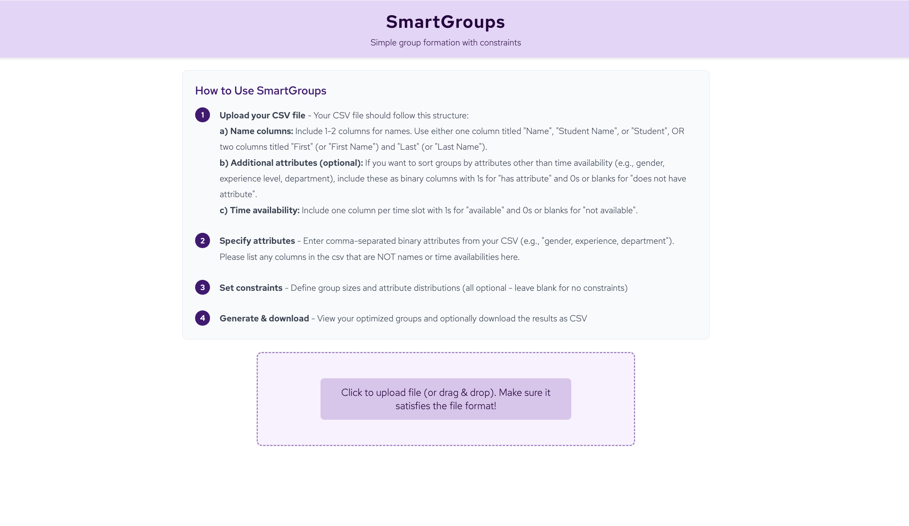
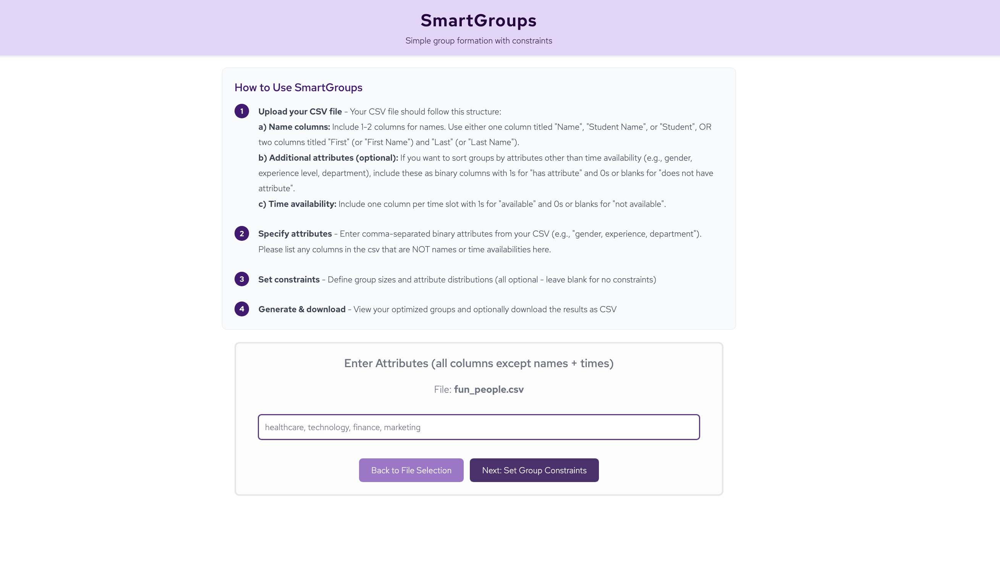
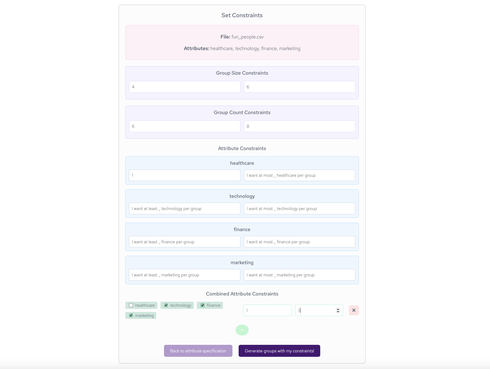
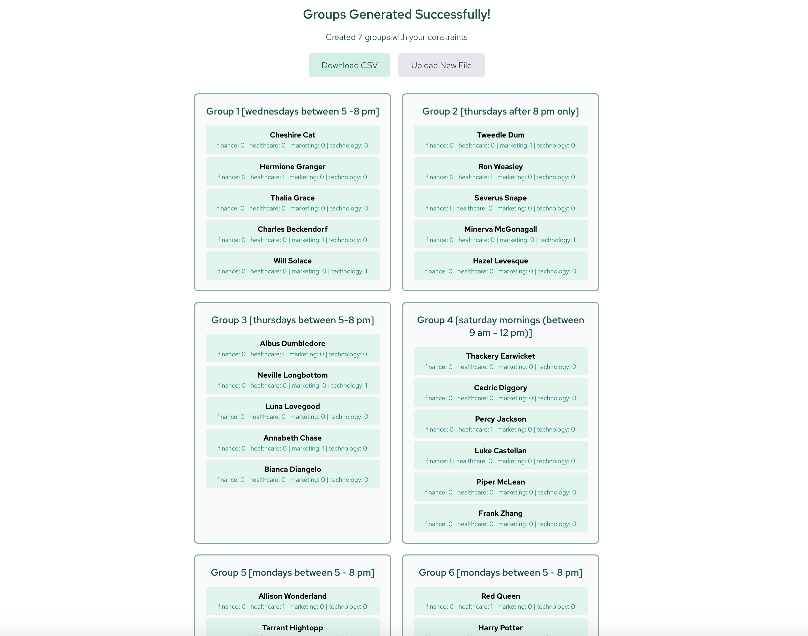
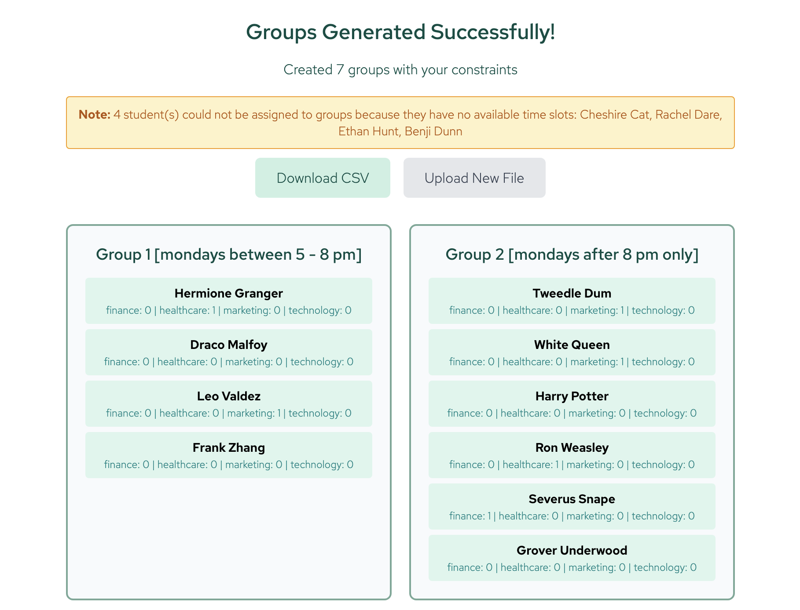
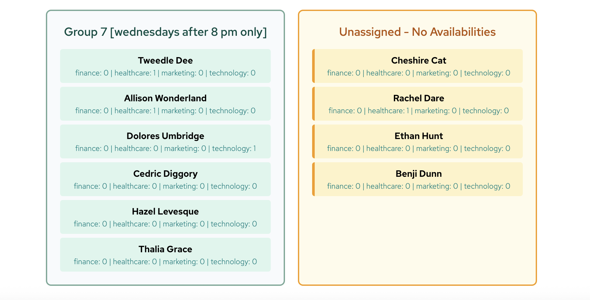

# SmartGroups
I built this app for my mom, a business school professor who was spending hours manually creating student groups for her class with very specific constraints. With this app, she does it in seconds. It was also my chance to finally prove to her that studying computer science can make me a useful member of society (at least to her)!

SmartGroups is a simple, locally-deployable web app designed to help educators and organizers quickly create student groups or meeting schedules based on time constraints and some desired group attributes. This project was inspired by the challenge of manually scheduling groups of students with specific requirements — somehow, ChatGPT is terrible at handling scheduling tasks with even a few constraints and available scheduling tools are a major pain. 

It runs completely on your own computer with no access to the internet (instead of as a hosted web app), in order to ensure that all data you upload about students / subjects is completely contained on your device.

## What is SmartGroups?
SmartGroups lets you upload a CSV file containing a list of names/identifiers, optional binary attributes, and binary availabilities. The app then forms groups that satisfy your specified constraints, making scheduling and group creation fast and friendly. There are some simple guidelines to structure your CSV for input (detailed below) — if you work with Excel or Google Sheets, however, it should be very simple to export as a CSV.

## How to Download and Run (No GitHub Account Needed)

1. **How to Download the App**
   - [Click here to download the latest version as a ZIP file](https://github.com/mochabytes/SmartGroups/archive/refs/heads/main.zip)
   - Unzip the downloaded file
   - Move it from Downloads to your home directory (i.e. the folder that contains Downloads). You can do this by just moving the file in your Finder/File Explorer.
   - On Mac, you can also do this by pressing Cmd + Space and typing terminal, then pressing enter. Then run the following commands:
     ```sh
     cd ~
     mv ~/Downloads/SmartGroups-main .
     ```

2. **Install Requirements**
   - Make sure you have Python 3 and Node.js installed on your system.
   - If you do not have them, follow these instructions:
     - **Python 3:**
       - [Download Python 3 here](https://www.python.org/downloads/)
       - On Mac: You can also use Homebrew: `brew install python3`
       - On Ubuntu/Linux: `sudo apt-get update && sudo apt-get install python3`
     - **Node.js:**
       - [Download Node.js here](https://nodejs.org/)
       - On Mac: You can also use Homebrew: `brew install node`
       - On Ubuntu/Linux: `sudo apt-get update && sudo apt-get install nodejs npm`
   - Open a terminal (on Mac, Cmd + Space and then type terminal + press enter) and navigate to the unzipped folder (cd smartgroups).

3. **Run the App**
   - On Mac/Linux:
     ```sh
     cd ~/smartgroups-main
     ./run.sh
     ```
   - On Windows:
     - Open Command Prompt or PowerShell
     - Run:
       ```sh
       bash run.sh
       ```

4. **Open in Your Browser**
   - After running the script, open your browser and go to: [http://localhost:3000](http://localhost:3000). It should do this automatically for you.

## Data Format Guidelines
- **CSV File:**
  - Each row should represent a participant (e.g., student).
  - Include columns for names/identifiers, any binary attributes (e.g., attribute: possess it: 1/ does not: 0), and availability (e.g., available: 1/unavailable: 0).
- **Naming Rules:**
  - Use clear, unique identifiers for each participant.
- **Attribute Rules:**
  - Binary attributes only (e.g., "Has experience": 1 or 0).
- **Availability Rules:**
  - Use 1 for available, 0 for unavailable.

## Supported Constraints
- Minimum and maximum group size
- Minimum and maximum number of groups
- Individual attribute requirements per group
- Combined group attribute constraints (e.g. I want at most/least X number of people who have attribute A or B or C per group)

## How SmartGroups Solves Grouping
Right now, SmartGroups uses Google's OR-Tools SAT solver (a type of constraint programming solver), which is specifically designed for boolean satisfiability and general constraint satisfaction problems.

## Error messages
If there is no solution given the constraints that you provide, you should under most circumstances get an error message. Some common ones are
- At least one student has no available times (it should tell you which ones)
- The constraints are too strict
- Your file is in the wrong format

## Output
- Group assignments based on your constraints
- Option to export results as a CSV file

---

If you have suggestions or want to contribute, please open a PR or email themochabytes@gmail.com. This app was built quickly, and this is my first app, so feedback and feature requests are especially welcome!


## Preview of how it looks:





And if some of the students are missing availabilities, it will tell you...

...and create an "Unassigned" group that you may handle however you wish:


Examples of input sheets and the corresponding results are available under examples/sample_input_sheets. Sample output CSVs are under examples/sample_result_sheets.

